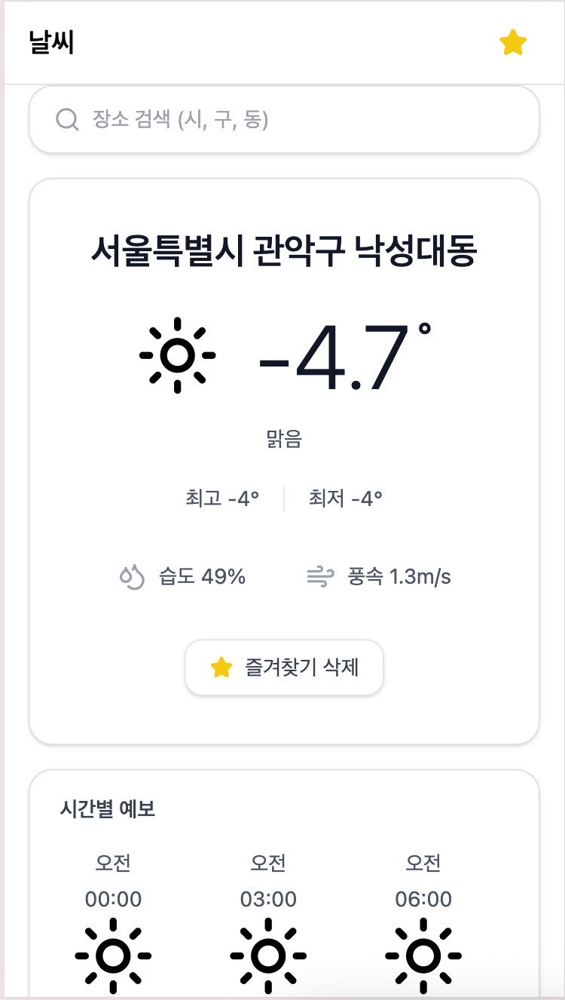
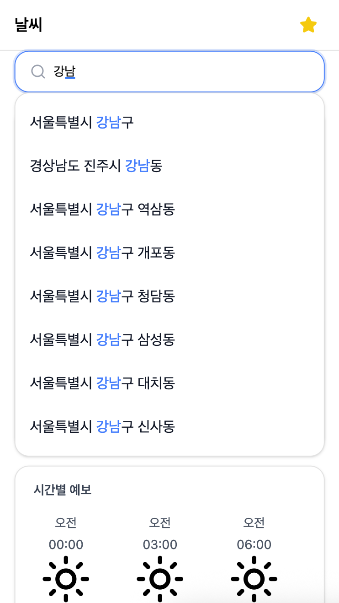
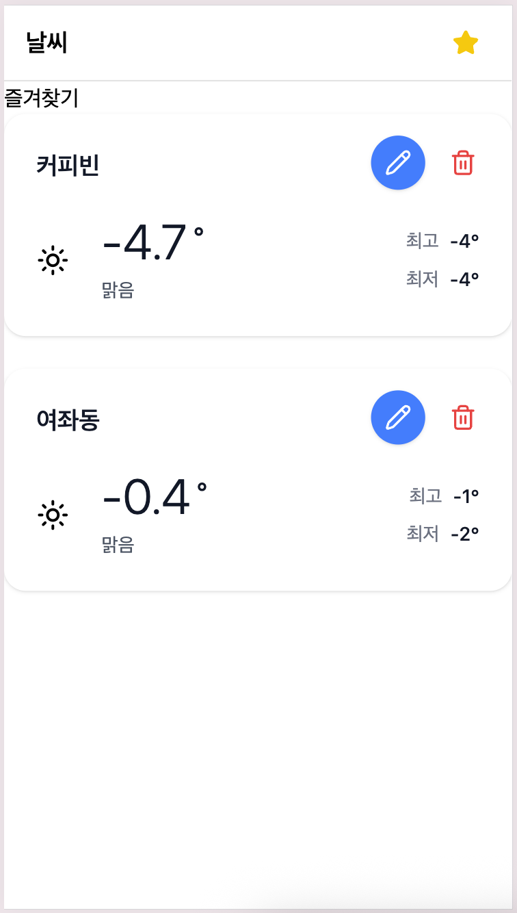

# 날씨 앱 과제

사용자의 현재 위치와 즐겨찾기한 장소의 날씨 정보를 보여주는 웹 애플리케이션입니다. 날씨 데이터를 효과적으로 가져오고, 검색 및 즐겨찾기 기능을 통해 사용자 맞춤 날씨 정보를 확인할 수 있도록 설계되었습니다.

## 배포 사이트

https://realteeth-fe-assignments.vercel.app/

## 🖥️ 주요 화면

<div style="display: flex; gap: 12px;">
  
  
  
</div>

<p align="center">
날씨 페이지(홈페이지) / 검색 화면 / 즐겨찾기
</p>

## ✨ 주요 기능

- **현재 위치 날씨**: 접속 시 사용자의 현재 위치를 기반으로 실시간 날씨, 최저/최고 기온 정보를 표시합니다.
- **날씨 검색**: 도시나 지역 이름으로 원하는 장소의 날씨를 검색하고 확인할 수 있습니다.
- **즐겨찾기 관리**: 자주 확인하는 장소를 즐겨찾기에 추가하거나 삭제할 수 있습니다.
- **즐겨찾기 수정**: 즐겨찾기에 저장된 장소의 이름을 수정하거나 목록에서 삭제할 수 있습니다.

## 🤔 기술적 의사결정

프로젝트를 진행하며 내린 주요 결정과 그 이유입니다.

### 1) 즐겨찾기 데이터 저장 전략

실시간으로 변하는 날씨 정보(`현재 기온`, `날씨 상태` 등)는 저장하지 않고, `이름`과 `좌표` 같은 고유 식별값만 `localStorage`에 저장하는 전략을 선택했습니다. 이는 데이터의 신선도를 보장하기 위함입니다. 즐겨찾기 목록을 확인할 때마다 저장된 좌표를 기반으로 서버로부터 항상 최신 날씨 정보를 가져올 수 있으며, `localStorage`를 통해 즐겨찾기 목록의 영속성도 확보했습니다.

### 2) 중앙화된 상태 관리 (SSOT)

즐겨찾기 목록은 여러 화면과 컴포넌트에서 동시에 참조되고 변경되는 데이터이기 때문에, 상태가 분산되지 않도록 `React Context + Provider` 패턴으로 중앙에서 관리했습니다.
이를 통해 즐겨찾기 데이터가 각 컴포넌트의 로컬 상태로 흩어지는 것을 방지하고, 애플리케이션 전역에서 **단일 데이터 소스(Single Source of Truth)** 를 유지했습니다.

또한 즐겨찾기의 추가, 삭제, 이름 수정과 같은 변경 로직을 useFavorites 커스텀 훅에 모아 관리함으로써,
어느 컴포넌트에서 접근하더라도 동일한 규칙과 흐름으로 상태가 변경되도록 보장했습니다.
그 결과 컴포넌트는 “어떻게 바뀌는지”를 알 필요 없이, 상태를 소비하는 역할에만 집중할 수 있도록 책임을 분리했습니다.

### 3) '현재 위치'와 '검색 위치'의 상태 분리

사용자가 주소를 검색할 때, 기존의 '현재 위치' 기반 날씨 상태를 덮어쓰지 않고 '검색 위치'라는 별도의 상태로 관리하도록 분리했습니다. `setFromGeo`, `setFromSearch`처럼 명시적인 setter를 사용하여 상태의 출처를 명확히 구분함으로써, 두 상태가 섞여 발생할 수 있는 혼란스러운 UX를 방지했습니다. 결과적으로 사용자의 명시적인 액션에 따라 UI가 예측 가능하게 반응하도록 만들 수 있었습니다.

### 4) 캐싱 전략

- **날씨 요약 데이터**
  - 실시간성이 요구되지만 분 단위의 즉각적인 최신성까지는 필요하지 않다고 판단해, 위경도 기준으로 캐시를 분리하고 `staleTime`을 3분으로 설정했습니다.
  - 이를 통해 동일 위치 재조회 및 즐겨찾기 목록 조회 시 불필요한 네트워크 요청을 줄였습니다.

- **행정구역(주소) 변환 데이터**
  - 행정구역 정보는 변동 가능성이 낮은 데이터 특성을 고려해, 동일 좌표 기준으로 캐싱하고 `staleTime`을 1시간으로 설정했습니다.
  - 이미 위치 라벨이 존재하는 경우에는 요청을 생략해 리버스 지오코딩 API 호출을 최소화했습니다.

## 🛠️ 기술 스택

| 기술                             | 선택 이유                                                                                                                                                                                                                                                                                                                                                      |
| -------------------------------- | -------------------------------------------------------------------------------------------------------------------------------------------------------------------------------------------------------------------------------------------------------------------------------------------------------------------------------------------------------------- |
| **TanStack Query (React Query)** | 서버 상태 관리를 단순화하기 위해 도입했습니다.<br/>- **캐싱 및 `staleTime`**: 불필요한 API 요청을 최소화하여 성능을 최적화합니다.<br/>- **로직 분리**: 데이터 페칭 로직을 UI 컴포넌트로부터 분리하여 코드 가독성과 재사용성을 높입니다.<br/>- **선언적 옵션**: `enabled`, `select` 등의 옵션을 활용해 요청 조건과 데이터 가공을 선언적으로 관리할 수 있습니다. |
| **Vite**                         | 빠른 개발 서버 시작과 즉각적인 모듈 리로딩(HMR)으로 개발 경험을 향상시키기 위해 선택했습니다.                                                                                                                                                                                                                                                                  |

## 🚀 프로젝트 실행 방법

```bash
# 1. 의존성 설치
$ npm i

# 2. 개발 서버 실행
$ npm run dev
```

## 📂 폴더 구조

프로젝트는 **FSD (Feature-Sliced Design)**를 기반으로 설계되었습니다. 각 폴더는 기능적 역할에 따라 명확하게 분리되어 유지보수성과 확장성을 높입니다.

```
src
├── app/         #  애플리케이션 전역 설정 (Provider, Router 등)
├── pages/       # 라우팅 단위의 페이지 컴포넌트
├── widgets/     # 여러 feature/entity를 조합한 독립적인 UI 블록 (e.g., 현재 날씨 카드)
├── features/    # 사용자 액션과 관련된 로직 (e.g., 즐겨찾기 추가) - (본 프로젝트에서는 entities/widgets에 통합)
├── entities/    # 핵심 비즈니스 모델과 관련 UI (e.g., 날씨, 위치, 즐겨찾기)
└── shared/      # 모든 계층에서 재사용되는 공통 코드 (API 클라이언트, UI 컴포넌트, 유틸리티 함수 등)
```

## 📝 구현 상세

### 현재 날씨 표시

- `useGeolocation` 훅을 통해 사용자의 현재 위치(좌표)를 얻습니다.
- `TanStack Query`의 `useQuery`를 사용하여 날씨 API를 호출하고, `enabled` 옵션으로 좌표를 받아온 뒤에만 요청하도록 설정했습니다.
- API 응답 데이터는 `select` 옵션을 활용해 UI에 필요한 형태로 가공(`mapper`)하여 컴포넌트에 전달합니다.

### 날씨 검색

- `input` 값은 `useDebouncedValue` 훅으로 디바운싱하여 불필요한 API 호출을 방지합니다.
- 검색된 주소 목록 중 하나를 선택하면 `LocationProvider`의 `setFromSearch` 함수가 호출되어 '검색 위치' 상태가 업데이트되고, 관련 UI가 리렌더링됩니다.

### 즐겨찾기

- `useFavorites` 훅은 `FavoriteProvider`의 `Context`와 상호작용하여 즐겨찾기 목록을 관리합니다.
- 별표 아이콘을 토글하면 `addFavorite` 또는 `removeFavorite` 함수가 실행되며, 변경 사항은 `localStorage`에 즉시 동기화됩니다.

### 삭제 및 수정

- 즐겨찾기 항목의 삭제/수정 버튼 클릭 시, 해당 항목의 고유 `id`를 `useFavorites` 훅의 `reName` 또는 `remove` 함수에 전달합니다.
- Provider는 중앙 상태를 업데이트하고, 이 변경 사항은 앱 내 모든 관련 컴포넌트에 자동으로 반영됩니다.
